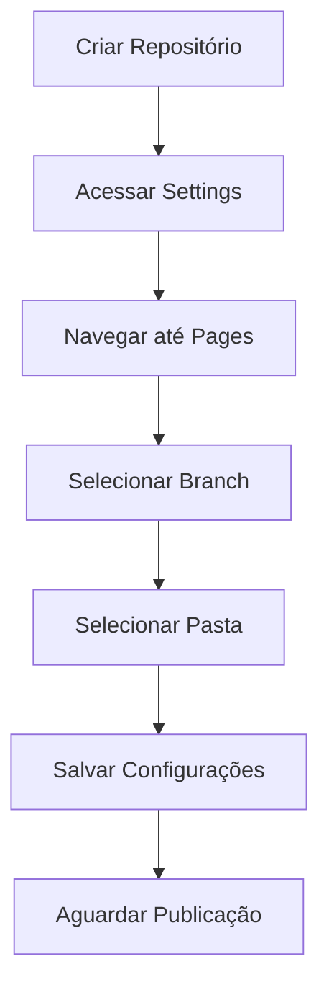

# 📘 Tutorial Completo: Como Criar e Personalizar GitHub Pages

[](https://pages.github.com/)
[](https://github.com/)
[](https://opensource.org/licenses/MIT)

> *Um guia detalhado para criar, personalizar e otimizar suas páginas no GitHub, desde o básico até funcionalidades avançadas.*

---

## 📋 Índice

- [Introdução](#-introdução)
- [Pré-requisitos](#-pré-requisitos)
- [Criando sua Primeira GitHub Page](#-criando-sua-primeira-github-page)
- [Personalizando com HTML/CSS](#-personalizando-com-htmlcss)
- [Utilizando Jekyll](#-utilizando-jekyll)
- [Temas Prontos](#-temas-prontos)
- [Domínio Personalizado](#-domínio-personalizado)
- [Otimização e SEO](#-otimização-e-seo)
- [GitHub Actions para Automação](#-github-actions-para-automação)
- [Exemplos Inspiradores](#-exemplos-inspiradores)
- [Soluções para Problemas Comuns](#-soluções-para-problemas-comuns)
- [Recursos Adicionais](#-recursos-adicionais)

---

## 🚀 Introdução

O GitHub Pages é um serviço de hospedagem gratuito que permite publicar sites diretamente de um repositório GitHub. É perfeito para:

- 👨‍💻 Portfólios pessoais
- 📝 Blogs técnicos
- 📚 Documentação de projetos
- 🏢 Sites institucionais simples
- 🎨 Showcase de projetos criativos

Este tutorial vai guiá-lo pelo processo completo, desde a criação básica até técnicas avançadas de personalização e otimização.

---

## ✅ Pré-requisitos

Antes de começar, você precisará:

- [ ] Uma conta no GitHub ([Registre-se aqui](https://github.com/join))
- [ ] Conhecimentos básicos de Git (clone, commit, push)
- [ ] Um editor de código como [Visual Studio Code](https://code.visualstudio.com/) ou [Atom](https://atom.io/)
- [ ] Conhecimentos básicos de HTML/CSS (para personalização)

**Software recomendado:**

| Ferramenta | Descrição | Link |
|------------|-----------|------|
| GitHub Desktop | Cliente Git com interface gráfica | [Download](https://desktop.github.com/) |
| Visual Studio Code | Editor de código com suporte a Markdown | [Download](https://code.visualstudio.com/) |
| Ruby | Necessário para Jekyll (opcional) | [Download](https://www.ruby-lang.org/) |

---

## 🔰 Criando sua Primeira GitHub Page

### 1. Crie um novo repositório

1. Acesse [github.com](https://github.com) e faça login em sua conta
2. No canto superior direito, clique no ícone "+" e selecione "New repository"
3. Nomeie seu repositório seguindo um dos formatos:
   - `seunomedeusuario.github.io` (site principal)
   - Qualquer nome (para projetos específicos)
4. Deixe o repositório como "Public"
5. Marque a opção "Add a README file"
6. Clique em "Create repository"


### 2. Configure o GitHub Pages

Para o site principal (`seunomedeusuario.github.io`):
1. O GitHub Pages já é automaticamente habilitado na branch principal

Para repositórios de projetos:
1. Vá para "Settings" do seu repositório
2. Navegue até a seção "Pages" no menu lateral esquerdo
3. Em "Source", selecione a branch (geralmente "main" ou "master")
4. Selecione a pasta (geralmente "/" ou "/docs")
5. Clique em "Save"



### 3. Crie seu primeiro conteúdo

1. No repositório, clique em "Add file" > "Create new file"
2. Nomeie-o como `index.html` ou `index.md`
3. Adicione conteúdo básico:

Para HTML:

```html
<!DOCTYPE html>
<html lang="pt-BR">
<head>
    <meta charset="UTF-8">
    <meta name="viewport" content="width=device-width, initial-scale=1.0">
    <title>Meu Site no GitHub Pages</title>
    <style>
        body {
            font-family: 'Segoe UI', Tahoma, Geneva, Verdana, sans-serif;
            line-height: 1.6;
            max-width: 800px;
            margin: 0 auto;
            padding: 20px;
            color: #333;
        }
        header {
            text-align: center;
            margin-bottom: 40px;
        }
        h1 {
            color: #0366d6;
        }
        footer {
            margin-top: 40px;
            text-align: center;
            font-size: 0.8em;
            color: #777;
        }
    </style>
</head>
<body>
    <header>
        <h1>Bem-vindo ao Meu Site!</h1>
        <p>Hospedado com GitHub Pages</p>
    </header>
    
    <main>
        <h2>Sobre Mim</h2>
        <p>Olá! Sou um desenvolvedor apaixonado por tecnologia.</p>
        
        <h2>Meus Projetos</h2>
        <ul>
            <li><a href="#">Projeto 1</a> - Breve descrição</li>
            <li><a href="#">Projeto 2</a> - Breve descrição</li>
        </ul>
    </main>
    
    <footer>
        <p>&copy; 2025 - Criado com 💙 e GitHub Pages</p>
    </footer>
</body>
</html>
```

Para Markdown:

```markdown
# Bem-vindo ao Meu Site!

## Sobre Mim

Olá! Sou um desenvolvedor apaixonado por tecnologia e inovação.

## Meus Projetos

- **[Projeto 1](link)** - Breve descrição
- **[Projeto 2](link)** - Breve descrição

---

Criado com 💙 e GitHub Pages
```

4. Clique em "Commit new file"

### 4. Verifique sua página

- Aguarde alguns minutos para o GitHub processar as alterações
- Acesse sua página em:
  - `https://seunomedeusuario.github.io` (site principal)
  - `https://seunomedeusuario.github.io/nome-do-repositorio` (páginas de projeto)

---

## 🎨 Personalizando com HTML/CSS

### Estrutura básica de arquivos

Para um site HTML/CSS simples, sua estrutura pode ser:

```
seu-repositorio/
├── index.html          # Página inicial
├── css/
│   └── style.css       # Folha de estilos
├── js/
│   └── script.js       # JavaScript
├── images/             # Imagens
└── README.md           # Informações sobre o repositório
```

### Exemplo de CSS personalizado

Crie um arquivo `css/style.css`:

```css
/* Variáveis CSS */
:root {
    --primary-color: #0366d6;
    --secondary-color: #28a745;
    --dark-color: #24292e;
    --light-color: #f6f8fa;
    --font-main: 'Segoe UI', Tahoma, Geneva, Verdana, sans-serif;
}

/* Reset básico */
* {
    margin: 0;
    padding: 0;
    box-sizing: border-box;
}

body {
    font-family: var(--font-main);
    line-height: 1.6;
    color: var(--dark-color);
    background-color: var(--light-color);
}

.container {
    max-width: 1100px;
    margin: 0 auto;
    padding: 0 20px;
}

/* Cabeçalho */
header {
    background-color: var(--dark-color);
    color: white;
    padding: 2rem 0;
    text-align: center;
}

.hero {
    padding: 3rem 0;
}

.hero h1 {
    font-size: 2.5rem;
    margin-bottom: 1rem;
    color: var(--primary-color);
}

/* Navegação */
nav {
    background-color: var(--primary-color);
    padding: 1rem 0;
}

nav ul {
    display: flex;
    justify-content: center;
    list-style: none;
}

nav li {
    margin: 0 15px;
}

nav a {
    color: white;
    text-decoration: none;
    font-weight: bold;
}

nav a:hover {
    text-decoration: underline;
}

/* Seções */
section {
    padding: 2rem 0;
}

section h2 {
    color: var(--primary-color);
    margin-bottom: 1rem;
    padding-bottom: 0.5rem;
    border-bottom: 2px solid var(--primary-color);
}

/* Projetos */
.projects {
    display: grid;
    grid-template-columns: repeat(auto-fill, minmax(300px, 1fr));
    gap: 20px;
    margin-top: 2rem;
}

.project-card {
    background: white;
    border-radius: 5px;
    box-shadow: 0 2px 5px rgba(0,0,0,0.1);
    padding: 20px;
    transition: transform 0.3s ease;
}

.project-card:hover {
    transform: translateY(-5px);
}

/* Rodapé */
footer {
    background-color: var(--dark-color);
    color: white;
    text-align: center;
    padding: 2rem 0;
    margin-top: 2rem;
}

/* Responsividade */
@media (max-width: 768px) {
    nav ul {
        flex-direction: column;
        align-items: center;
    }
    
    nav li {
        margin: 5px 0;
    }
    
    .projects {
        grid-template-columns: 1fr;
    }
}
```

### Incorpore o CSS na sua página HTML

Modifique seu `index.html` para incluir o arquivo CSS:

```html
<!DOCTYPE html>
<html lang="pt-BR">
<head>
    <meta charset="UTF-8">
    <meta name="viewport" content="width=device-width, initial-scale=1.0">
    <title>Meu Portfólio | GitHub Pages</title>
    <link rel="stylesheet" href="css/style.css">
    <!-- Ícones Font Awesome -->
    <link rel="stylesheet" href="https://cdnjs.cloudflare.com/ajax/libs/font-awesome/6.0.0-beta3/css/all.min.css">
</head>
<body>
    <header>
        <div class="container">
            <h1>Meu Portfólio</h1>
            <p>Desenvolvedor Web & Designer</p>
        </div>
    </header>
    
    <nav>
        <div class="container">
            <ul>
                <li><a href="#sobre"><i class="fas fa-user"></i> Sobre</a></li>
                <li><a href="#projetos"><i class="fas fa-code"></i> Projetos</a></li>
                <li><a href="#contato"><i class="fas fa-envelope"></i> Contato</a></li>
            </ul>
        </div>
    </nav>
    
    <main class="container">
        <section id="sobre" class="hero">
            <h2><i class="fas fa-user"></i> Sobre Mim</h2>
            <p>Sou um desenvolvedor apaixonado por criar soluções web inovadoras. Especializado em front-end e design de interfaces.</p>
        </section>
        
        <section id="projetos">
            <h2><i class="fas fa-code"></i> Meus Projetos</h2>
            <div class="projects">
                <div class="project-card">
                    <h3>Projeto 1</h3>
                    <p>Descrição detalhada do projeto.</p>
                    <a href="#" class="btn">Ver Projeto</a>
                </div>
                <div class="project-card">
                    <h3>Projeto 2</h3>
                    <p>Descrição detalhada do projeto.</p>
                    <a href="#" class="btn">Ver Projeto</a>
                </div>
                <div class="project-card">
                    <h3>Projeto 3</h3>
                    <p>Descrição detalhada do projeto.</p>
                    <a href="#" class="btn">Ver Projeto</a>
                </div>
            </div>
        </section>
        
        <section id="contato">
            <h2><i class="fas fa-envelope"></i> Contato</h2>
            <p>Entre em contato comigo através das redes sociais ou e-mail:</p>
            <div class="social-links">
                <a href="#"><i class="fab fa-github"></i> GitHub</a>
                <a href="#"><i class="fab fa-linkedin"></i> LinkedIn</a>
                <a href="mailto:seu-email@exemplo.com"><i class="fas fa-envelope"></i> Email</a>
            </div>
        </section>
    </main>
    
    <footer>
        <div class="container">
            <p>&copy; 2025 - Todos os direitos reservados</p>
            <p>Criado com <i class="fas fa-heart"></i> e GitHub Pages</p>
        </div>
    </footer>
</body>
</html>
```

---

## 📦 Utilizando Jekyll

Jekyll é um gerador de sites estáticos que o GitHub Pages suporta nativamente. Ele permite criar sites mais complexos sem precisar escrever todo o HTML manualmente.

### Instalando Jekyll localmente (opcional, mas recomendado)

1. Instale Ruby e o RubyGems
   - Windows: [RubyInstaller](https://rubyinstaller.org/)
   - macOS: `brew install ruby`
   - Linux: `sudo apt-get install ruby-full`

2. Instale Jekyll e Bundler:
   ```bash
   gem install jekyll bundler
   ```

3. Crie um novo site Jekyll:
   ```bash
   jekyll new meu-site-jekyll
   cd meu-site-jekyll
   ```

4. Execute localmente:
   ```bash
   bundle exec jekyll serve
   ```

5. Seu site estará disponível em http://localhost:4000

### Estrutura básica de um site Jekyll

```
meu-site-jekyll/
├── _config.yml               # Configurações do site
├── _posts/                   # Artigos de blog 
│   └── 2025-03-05-bem-vindo.md
├── _layouts/                 # Templates de página
│   ├── default.html
│   └── post.html
├── _includes/                # Fragmentos reutilizáveis
│   ├── header.html
│   └── footer.html
├── assets/                   # Arquivos estáticos
│   ├── css/
│   ├── js/
│   └── images/
├── _data/                    # Dados em YAML/JSON
│   └── navigation.yml
├── _site/                    # Site gerado (não editar)
├── .gitignore                # Arquivos ignorados pelo Git
├── Gemfile                   # Dependências Ruby
└── index.md                  # Página inicial
```

### Exemplo de configuração do Jekyll (`_config.yml`)

```yaml
# Informações do site
title: Meu Site com Jekyll
description: Um site incrível criado com Jekyll e GitHub Pages
author: Seu Nome
email: seu-email@exemplo.com
baseurl: "" # subpasta do repositório, se necessário
url: "https://seuusuario.github.io" # URL base do site

# Build settings
markdown: kramdown
remote_theme: jekyll/minima # tema remoto
plugins:
  - jekyll-feed
  - jekyll-seo-tag
  - jekyll-sitemap

# Configurações do permalink para posts
permalink: /blog/:year/:month/:day/:title/

# Coleções personalizadas
collections:
  projects:
    output: true
    permalink: /projects/:path/

# Informações de contato
social:
  twitter: seutwitter
  github: seugithub
  linkedin: seulinkedin

# Configurações adicionais
lang: pt-BR
timezone: America/Sao_Paulo
```

### Publicando seu site Jekyll no GitHub Pages

1. Crie um repositório no GitHub com o nome `seuusuario.github.io`
2. Inicialize o Git na pasta do seu projeto Jekyll:
   ```bash
   git init
   git add .
   git commit -m "Versão inicial do site Jekyll"
   git branch -M main
   git remote add origin https://github.com/seuusuario/seuusuario.github.io.git
   git push -u origin main
   ```

3. O GitHub Pages automaticamente construirá e publicará o site

> ⚠️ **Nota**: Você também pode usar o Jekyll Themes com GitHub Pages sem instalação local, apenas configurando o `_config.yml` com a propriedade `remote_theme`.

---

## 🎭 Temas Prontos

### Temas Jekyll Oficiais do GitHub Pages

Para usar um tema pré-definido:

1. Acesse "Settings" > "Pages"
2. Clique em "Choose a theme"
3. Selecione um dos temas disponíveis
4. Clique em "Select theme"

Temas oficiais disponíveis:
- Architect
- Cayman
- Dinky
- Hacker
- Leap day
- Merlot
- Midnight
- Minima
- Minimal
- Modernist
- Slate
- Tactile
- Time machine

### Outros temas Jekyll populares

Para usar estes temas, adicione-os ao seu `_config.yml` com `remote_theme`:

| Nome | Demonstração | Características |
|------|-------------|----------------|
| [Minimal Mistakes](https://mmistakes.github.io/minimal-mistakes/) | [Demo](https://mmistakes.github.io/minimal-mistakes/) | Responsivo, SEO otimizado |
| [Just the Docs](https://pmarsceill.github.io/just-the-docs/) | [Demo](https://pmarsceill.github.io/just-the-docs/) | Documentação, pesquisa |
| [Chirpy](https://chirpy.cotes.info/) | [Demo](https://chirpy.cotes.info/) | Blog, dark mode, categorias |
| [Beautiful Jekyll](https://beautifuljekyll.com/) | [Demo](https://beautifuljekyll.com/) | Social, comentários |

Exemplo de uso:

```yaml
# No _config.yml
remote_theme: mmistakes/minimal-mistakes
```

---

## 🌐 Domínio Personalizado

### Configurando um domínio personalizado

1. Compre um domínio em um registrador como [Namecheap](https://www.namecheap.com/), [GoDaddy](https://www.godaddy.com/) ou [RegistroBR](https://registro.br/)
2. No GitHub, vá para "Settings" > "Pages"
3. Na seção "Custom domain", digite seu domínio e clique em "Save"
4. No seu registrador de domínio, configure os registros DNS:

Para domínio apex (exemplo.com):
```
A     @     185.199.108.153
A     @     185.199.109.153
A     @     185.199.110.153
A     @     185.199.111.153
```

Para subdomínio (www.exemplo.com):
```
CNAME  www   seuusuario.github.io.
```

5. Aguarde a propagação do DNS (pode levar até 24 horas)
6. Ative HTTPS no GitHub Pages (em "Settings" > "Pages" > "Enforce HTTPS")

### Verificação do domínio

Para verificar se seu domínio está configurado corretamente:

```bash
dig exemplo.com +noall +answer
dig www.exemplo.com +noall +answer
```

---

## 🔍 Otimização e SEO

### Adicionando meta tags para SEO

Adicione estas meta tags ao `<head>` do seu HTML ou no layout Jekyll:

```html
<head>
    <!-- Meta tags básicas -->
    <meta charset="UTF-8">
    <meta name="viewport" content="width=device-width, initial-scale=1.0">
    <title>Título da Página | Nome do Site</title>
    <meta name="description" content="Descrição da página em 150-160 caracteres">
    <meta name="author" content="Seu Nome">
    
    <!-- Open Graph (Facebook, LinkedIn) -->
    <meta property="og:title" content="Título da Página">
    <meta property="og:description" content="Descrição da página">
    <meta property="og:image" content="https://seusite.com/imagem.jpg">
    <meta property="og:url" content="https://seusite.com/pagina">
    <meta property="og:type" content="website">
    
    <!-- Twitter Card -->
    <meta name="twitter:card" content="summary_large_image">
    <meta name="twitter:title" content="Título da Página">
    <meta name="twitter:description" content="Descrição da página">
    <meta name="twitter:image" content="https://seusite.com/imagem.jpg">
    
    <!-- Canonical URL -->
    <link rel="canonical" href="https://seusite.com/pagina">
    
    <!-- Favicon -->
    <link rel="icon" href="/favicon.ico">
    <link rel="icon" type="image/png" sizes="32x32" href="/favicon-32x32.png">
    <link rel="apple-touch-icon" sizes="180x180" href="/apple-touch-icon.png">
</head>
```

### Criando um sitemap.xml

Se não estiver usando Jekyll (que gera automaticamente com o plugin `jekyll-sitemap`), crie um arquivo `sitemap.xml`:

```xml
<?xml version="1.0" encoding="UTF-8"?>
<urlset xmlns="http://www.sitemaps.org/schemas/sitemap/0.9">
   <url>
      <loc>https://seusite.com/</loc>
      <lastmod>2025-03-05</lastmod>
      <changefreq>monthly</changefreq>
      <priority>1.0</priority>
   </url>
   <url>
      <loc>https://seusite.com/sobre</loc>
      <lastmod>2025-03-01</lastmod>
      <changefreq>yearly</changefreq>
      <priority>0.8</priority>
   </url>
   <!-- Adicione mais URLs aqui -->
</urlset>
```

### Melhoria de performance

1. Comprima imagens
   - Use [TinyPNG](https://tinypng.com/) ou [Squoosh](https://squoosh.app/)
   
2. Minifique CSS/JavaScript
   - Use [Minifier](https://www.minifier.org/)
   
3. Carregue o CSS crítico inline
   ```html
   <style>
     /* CSS crítico aqui */
   </style>
   <link rel="preload" href="style.css" as="style" onload="this.onload=null;this.rel='stylesheet'">
   ```

4. Use carregamento lazy para imagens
   ```html
   
   ```

---

## ⚙️ GitHub Actions para Automação

O GitHub Actions permite automatizar workflows, como a construção e publicação do seu site.

### Exemplo de workflow para Jekyll

Crie um arquivo `.github/workflows/jekyll-build.yml`:

```yaml
name: Build and Deploy Jekyll

on:
  push:
    branches: [ main ]
  pull_request:
    branches: [ main ]

jobs:
  build:
    runs-on: ubuntu-latest
    steps:
    - uses: actions/checkout@v2
    
    - name: Set up Ruby
      uses: ruby/setup-ruby@v1
      with:
        ruby-version: '3.0'
        bundler-cache: true
    
    - name: Install dependencies
      run: |
        gem install bundler
        bundle install
    
    - name: Build site
      run: bundle exec jekyll build
    
    - name: Deploy
      uses: peaceiris/actions-gh-pages@v3
      if: github.ref == 'refs/heads/main'
      with:
        github_token: ${{ secrets.GITHUB_TOKEN }}
        publish_dir: ./_site
```

### Exemplo de workflow para Node.js/React

Crie um arquivo `.github/workflows/node-build.yml`:

```yaml
name: Build and Deploy React App

on:
  push:
    branches: [ main ]

jobs:
  build:
    runs-on: ubuntu-latest
    steps:
    - uses: actions/checkout@v2
    
    - name: Set up Node.js
      uses: actions/setup-node@v2
      with:
        node-version: '16'
        cache: 'npm'
    
    - name: Install dependencies
      run: npm ci
    
    - name: Build
      run: npm run build
    
    - name: Deploy
      uses: JamesIves/github-pages-deploy-action@4.1.4
      with:
        branch: gh-pages
        folder: build
```

---

## ✨ Exemplos Inspiradores

### Portfólios em GitHub Pages

| Nome | URL | O que aprender |
|------|-----|----------------|
| [Brittany Chiang](https://brittanychiang.com/) | [Repositório](https://github.com/bchiang7/v4) | Design minimalista, animações |
| [Jacek Jeznach](https://jacekjeznach.com/) | - | Experiência interativa |
| [Rafael Caferati](https://caferati.me/) | [Repositório](https://github.com/rcaferati/react-awesome-slider) | React, animações |
| [Lynn Fisher](https://lynnandtonic.com/) | - | Criatividade, CSS avançado |

### Sites de documentação

| Nome | URL | O que aprender |
|------|-----|----------------|
| [Tailwind CSS](https://tailwindcss.com/docs) | - | Organização de conteúdo |
| [React Native Paper](https://callstack.github.io/react-native-paper/) | [Repositório](https://github.com/callstack/react-native-paper) | Documentação de componentes |
| [Just the Docs](https://pmarsceill.github.io/just-the-docs/) | [Repositório](https://github.com/pmarsceill/just-the-docs) | Navegação, busca |

---

## 🛠️ Soluções para Problemas Comuns

### Site não aparece após configuração

**Problema**: Configurei o GitHub Pages, mas recebo 404 ou o site não aparece.

**Soluções**:
1. Verifique se o repositório é público
2. Confira se a branch selecionada é a correta em Settings > Pages
3. Certifique-se de ter um arquivo `index.html` ou `index.md` na raiz
4. Aguarde até 10 minutos para o GitHub construir e publicar o site
5. Verifique erros de build nos logs do GitHub Actions (se estiver usando)

### Estilos CSS não são aplicados

**Problema**: Meu CSS não está sendo aplicado no GitHub Pages.

**Soluções**:
1. Verifique os caminhos relativos (use `/css/style.css` em vez de `css/style.css`)
2. Confirme se o arquivo CSS está sendo enviado para o repositório
3. Verifique erros no console do navegador
4. Para sites de projeto, ajuste o `baseurl` no Jekyll:
   ```yaml
   baseurl: "/nome-do-repositorio"
   ```

### Problemas com Jekyll

**Problema**: Erros de build com Jekyll.

**Soluções**:
1. Verifique se está usando gemas compatíveis com GitHub Pages:
   ```ruby
   # No Gemfile
   source "https://rubygems.org"
   gem "github-pages", group: :jekyll_plugins
   ```
2. Teste localmente antes de enviar:
   ```bash
   bundle exec jekyll serve
   ```
3. Verifique a [documentação de dependências do GitHub Pages](https://pages.github.com/versions/)

---

## 📚 Recursos Adicionais

### Documentação Oficial

- [Documentação GitHub Pages](https://docs.github.com/pt/pages)
- [Documentação Jekyll](https://jekyllrb.com/docs/)
- [Guia de Markdown](https://www.markdownguide.org/)

### Ferramentas Úteis

- [Font Awesome](https://fontawesome.com/) - Ícones gratuitos
- [Google Fonts](https://fonts.google.com/) - Fontes gratuitas
- [Coolors](https://coolors.co/) - Geradores de paletas de cores
- [Unsplash](https://unsplash.com/) - Imagens gratuitas
- [Carbon](https://carbon.now.sh/) - Criador de imagens de código
- [Animate.css](https://animate.style/) - Biblioteca de animações CSS
- [Shields.io](https://shields.io/) - Criador de badges para README
- [CSS Grid Generator](https://cssgrid-generator.netlify.app/) - Gerador de layouts CSS Grid
- [Favicon.io](https://favicon.io/) - Gerador de favicons

### Cursos e Tutoriais

- [GitHub Learning Lab](https://lab.github.com/) - Cursos gratuitos interativos
- [Jekyll Step by Step Tutorial](https://jekyllrb.com/docs/step-by-step/01-setup/) - Tutorial oficial do Jekyll
- [MDN Web Docs](https://developer.mozilla.org/) - Documentação completa sobre web
- [freeCodeCamp](https://www.freecodecamp.org/) - Cursos gratuitos de desenvolvimento web

### Comunidades

- [GitHub Community Forum](https://github.community/)
- [Jekyll Talk](https://talk.jekyllrb.com/)
- [Stack Overflow](https://stackoverflow.com/questions/tagged/github-pages)
- [Dev.to](https://dev.to/t/githubpages)

## 🚀 Conclusão

Parabéns! Você agora tem conhecimento completo para criar, personalizar e otimizar um site utilizando GitHub Pages. Desde a criação básica até funcionalidades avançadas, este guia abrange tudo o que você precisa para criar uma presença online profissional e impressionante.

Lembre-se que a prática é fundamental. Comece com um site simples e vá adicionando recursos gradualmente à medida que se familiariza com as ferramentas e tecnologias.

### Próximos passos

1. 🎯 Crie seu primeiro site básico
2. 🔄 Atualize regularmente com novos conteúdos
3. 🧪 Experimente diferentes temas e layouts
4. 📱 Garanta que seu site seja responsivo
5. 📈 Implemente análises com Google Analytics
6. 🔍 Otimize para mecanismos de busca
7. 🌐 Considere adquirir um domínio personalizado

---

<div align="center">

[](https://github.com/seuusuario/seurepositorio)

**Se este tutorial foi útil, considere deixar uma ⭐ no repositório!**

[🔝 Voltar ao topo](#-tutorial-completo-como-criar-e-personalizar-github-pages)

</div>

---

<div align="center">
  <p>Feito com ❤️ por <a href="https://github.com/seuusuario">Leandro Venturini Sodré</a></p>
  <p>© 2025 - Licenciado sob <a href="https://opensource.org/licenses/MIT">MIT License</a></p>
</div>
